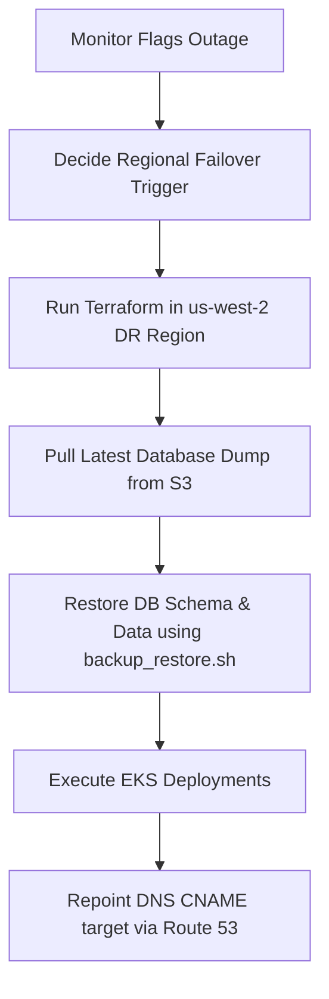

# disaster_recovery_plan.md

# Disaster Recovery (DR) Plan
## Project AquaGuard

This document outlines the high-availability architecture, backup regimes, and failover workflows for the AquaGuard platform.

---

## 1. Core Metrics
*   **Recovery Point Objective (RPO)**: **15 Minutes**. Maximum allowable data loss during a cluster disaster.
*   **Recovery Time Objective (RTO)**: **1 Hour**. Maximum target duration to restore services to operational status.

---

## 2. Backup Retention Schedules

| Backup Type | Frequency | Storage Location | Retention Period |
| :--- | :--- | :--- | :--- |
| **Database Backup** | Daily (pg_dump) | local `/tmp` & S3 Bucket | 30 Days |
| **Full Backup** | Weekly (System snapshots) | Offsite AWS region S3 | 90 Days |
| **Archive Backup** | Monthly (Compressed archives) | Glacier deep archive | 7 Years |

---

## 3. Database Replication & Cloud Backup
*   **Active-Standby Replication**: Multi-AZ PostgreSQL RDS database instance deployed with synchronous replication.
*   **Cross Region Replication**: S3 buckets are configured with cross-region replication rules sending encrypted daily WAL logs from `us-east-1` (Primary) to `us-west-2` (DR site).

---

## 4. Disaster Recovery & Failover Workflow



### Steps to execute manual restore in backup region:
1.  **Deploy infrastructure**:
    ```bash
    cd devops/terraform
    terraform init
    terraform apply -var="aws_region=us-west-2" -auto-approve
    ```
2.  **Pull files**: Download the database backup file from S3 (`s3://aquaguard-backups-us-west-2/`).
3.  **Perform DB Restore**:
    ```bash
    chmod +x devops/disaster-recovery/backup_restore.sh
    ./devops/disaster-recovery/backup_restore.sh restore /path/to/downloaded_s3_backup.sql
    ```
4.  **Launch Pods**:
    ```bash
    kubectl apply -f devops/kubernetes/
    ```
5.  **DNS Switch**: Repoint AWS Route 53 routing rules to redirect user requests to the active EKS Application Load Balancer endpoint in `us-west-2`.
