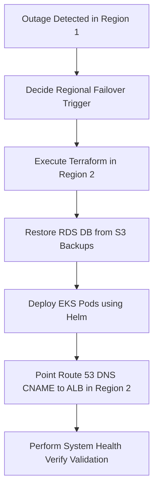

# disaster_recovery_plan.md

# Disaster Recovery (DR) Plan
## Project AquaGuard

This document outlines the backup, replication, and disaster recovery strategy for the AquaGuard Smart Water Monitoring & Management Platform.

---

## 1. Objectives & Metrics
- **Recovery Point Objective (RPO)**: $\le 1 \text{ Hour}$. In the event of a cluster-wide failure, data loss must not exceed 60 minutes of history.
- **Recovery Time Objective (RTO)**: $\le 15 \text{ Minutes}$. The system must be fully restored and online within 15 minutes of a disaster trigger.

---

## 2. Backup Strategy
### 2.1 Database Backups (PostgreSQL)
- **Snapshot Frequency**: Daily automated AWS EBS snapshots of the PostgreSQL RDS volumes.
- **Log Archiving**: Continuous WAL (Write-Ahead Logging) archiving shipped to Amazon S3 bucket `s3://aquaguard-db-wal-backups/` every 15 minutes.
- **Logical Dump**: Daily pg_dump backup stored offsite in separate AWS region (e.g., `us-west-2`).

### 2.2 Application State Backups
- Application code is fully stored in GitHub version control.
- Docker files and base images are saved in AWS ECR.
- Kubernetes deployment manifests are stored in Git repositories.

---

## 3. High Availability & Database Replication
To achieve $\le 15 \text{ minutes}$ RTO:
- **Active-Standby Setup**: Multi-AZ RDS configuration deployed across separate availability zones (`us-east-1a` and `us-east-1b`).
- **Replication Mode**: Synchronous replication between the Primary database instance and the Standby replica instance.
- **Automatic Failover**: If the Primary instance goes down, AWS Route 53 CNAME dynamically switches to the Standby replica within 60 seconds.

---

## 4. Disaster Failover Steps
If a total region outage occurs in `us-east-1`:



1. **Verify Outage**: The Operations Manager asserts server failures via CloudWatch/Grafana.
2. **Launch Target Infrastructure**: Execute Terraform scripts pointing to the backup region (`us-west-2`):
   ```bash
   terraform init -backend-config="region=us-west-2"
   terraform apply -var="aws_region=us-west-2" -auto-approve
   ```
3. **Restore DB**: Restore the latest RDS backup image from the S3 bucket.
4. **Deploy Application**: Run Jenkins deployment scripts to apply Kubernetes pods.
5. **Switch Traffic**: Route 53 DNS records switch domain mapping to the active Load Balancer in the backup region.
